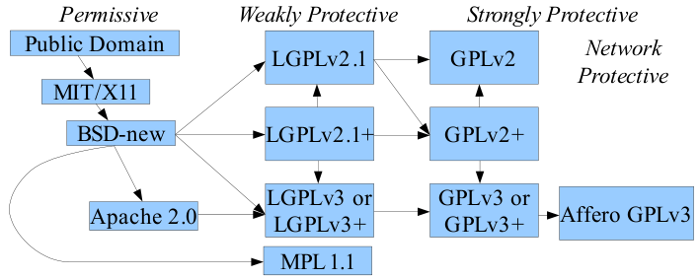

I've spent a couple of months reading all sorts of articles and news about Free Software, Open-Source, licensing and more importantly the different business model strategies you can adopt to support financially your next amazing Free Libre Open Source Software project.

I want to summarize here the most important thing that I've learnt and that I think everyone in the industry should know. I will finish by suggesting an innovative community-centric business model called "Robin Hood" that you can use to support your next Free software library. 

This essay is long because it is beginner-friendly. You do not need any background in software licensing, or even in software development to read it. In fact, my wife who is not in technology in any ways, was able to comprehend its content.

I'll start by a few definitions. If you are in tech, while it may appear trivial I encourage you NOT to skip that section, especially if you consider yourself as a junior/mid-level developer, but it also applies to many senior developers. I've read many mischaracterizations and misunderstandings on the very meaning of Free Software, Open Source and the different licenses to know that you might be confused about these notions maybe without realizing it. As a matter of fact, lots of tech/business articles happily make these confusions everyday.

# I. Definitions and context

## I.1. Free Software

Free Software is a term invented by Richard Stallman.
It was invented at a time when almost every piece of software was proprietary. No one was ever sharing source code. The software industry was following the same principle as the other industries: you make a product inside your company, you sell it and you keep your recipe ultra secret. A business model based on selling ultra-expensive perpetual licenses.
Free Software's motto is "Free as in Freedom". Freedom for the user as opposed to the developers.
It all started when Richard got frustrated after his printer couldn't work and he realized he didn't have access to its source code to fix it. And everyone was refusing giving him the source code because they had signed a NDA. You can read the whole story on [gnu.org](https://www.gnu.org/philosophy/rms-nyu-2001-transcript.txt).

What are those freedoms?

>	First, Freedom Zero is the freedom to run the program for any purpose, any way you like.  
>	Freedom One is the freedom to help yourself by changing the program to suit your needs.  
>	Freedom Two is the freedom to help your neighbor by distributing copies of the program.  
>	And Freedom Three is the freedom to help build your community by publishing an improved version so others can get the benefit of your work.  

Free Software DOES NOT mean the software is free as in free beer. Nothing forbids you to sell your software for 1000000 dollars or give it away for free if you wish. It does NOT mean "non-commercial".

It is defined as opposed to so-called proprietary/non-free softwares, that was particularly common back at the time (and still is today...). It has NOTHING to do with closed-source as opposed to open-source softwares.

The Free Software Foundation (FSF) was created to promote the ideology of Free Software and to promote making Free Software.

You can read on Business Insider a recent example of misrepresentation of the Free Software ideology (Free confused with free beer as opposed to Freedom + Stallman wrongly related to open-source): ["He [Stallman] pioneered the concept of free and open source software (FOSS), whereby any programmer can create, contribute to, and give away software for free — offering viable alternatives to corporate-owned and created software."](https://www.businessinsider.fr/us/gnu-programmers-call-for-richard-stallman-to-quit-2019-10)

There are hundreds of similar example of mischaracterization since the start of the movement.

## I.2. The GNU Project and the Linux Kernel

In particular the FSF was raising funds from donations to hire developers to work on making a Free Operating System. It is the GNU Project.

An operating system (OS) is made on hell of a lot of different components, one of which being the kernel.
Linus Torvalds had already created a kernel (a hardcore chunk of software) that was working well and that was also a Free Software: "Linux".
Linux was used in the GNU OS and the GNU OS was finally released under the name "Linux" or "GNU/Linux". There is a [controversy on the name of the OS](https://en.wikipedia.org/wiki/GNU/Linux_naming_controversy): the FSF encourages people to use "GNU/Linux".

## I.3. Copyright and software licensing

First of all, as creator of a software, you hold the full copyright over your work. You can distribute it under any license, and you're NOT legally entitled to follow the license you are choosing to distribute your software to, because you hold the copyright of the software. That's something many people are confused about.

You choose a license that says how OTHERS can use your software. Which rights and obligations you grant them when publishing your source code.

As creator of the initial project, by default you do not hold the copyright for the code the external contributors sent to your repository.
As such, you may not have the right to do anything you want with their contributions. It depends on the license of their contribution. If the external contributors pushed their code to your repository on GitHub for instance, then the same license you chose will apply to their contribution.

However, there is a way to make external contributors hand-over their copyrights to you: the [Contributor License Agreement (CLA)](https://en.wikipedia.org/wiki/Contributor_License_Agreement). You can force them to sign this document before accepting their pull-request. There are many types of CLA, it is rather complex so I won't dive into it just yet.

## I.4. GNU GPL

In order to enforce the 4 Freedoms of Free Software, Stallman created the [GNU General Public License (GPL)](https://www.gnu.org/licenses/quick-guide-gplv3.html).

At its core, it does the following:
- you can do whatever you want when using the software for your own internal use.
- when distributing the software to somebody (as a commercial transaction or not), you must give them the source code. You cannot only give them binaries.
- then, the entity receiving the program is free to study the source code, modify it, sell it, redistribute it. They can even publish the source code online, but they don't have to and nobody can demand from them to get their modified version. They are free to keep it for them if they want. When redistributing the software, they must give the source code as well.
- anyone that make a modification to the GPL software keep his copyright to the portion of the code corresponding to his contribution
- if you make modification to the software in any way and use it for your internal use, you can do whatever you want.
- if you make modification to the software in any way and distribute it to somebody else, then your modified work must be licensed under the GNU GPL too and as such you must distribute the source code of the modified work to the person/entity you are distributing your modified software to.

The last point is the socalled "copyleft" effect. It means that by using a GNU GPL licensed software to make a modified work, you are somehow impeding your copyright over the modified work in the sense that you are obliged to use the same license GNU GPL when you distribute it. You will keep your copyright over your own work, but it is the result of the contract you accepted when you started using the GPL software to make your own.

The GNU GPL is sometimes refered by its detractors as "restrictive" and "viral" license. Developers tend [not to understand why the Free Software guys talk about "freedom" all the while "restricting" the way newly created software is being used](https://ayende.com/blog/186146-A/making-money-from-open-source-software-the-dichotomy). That's because it is about freedom of the users. It is about freeing the software from one particular vendor, as is the case for proprietary softwares. It is also about freeing the software from the developers and transferring this freedom to the users. Not only freeing it from the initial developers but also all the subsequent ones - that is the very reason why copyleft has been created: to make sure any modifications of the software remain free. So that the source code can get its own life.

All the softwares released by the GNU Project are licensed under the GPL. 
Linux is also licensed under the GPL. 
 
As you can see, by definition, GPL softwares are incompatible with proprietary softwares ;).

You may wonder how the heck can you make sure that nobody breaches this license, since the code lives its own life out there in the wild.
Well, this is a real issue. [The FSF gives legal support](https://www.gnu.org/licenses/gpl-violation.en.html) to anyone witnessing a GNU GPL infrigement.
Sadly, many companies seem  to embrace GPL violations, as with [this 3D Printer](https://www.youtube.com/watch?v=I6FRig3LUkw&t) or [many Android-based OS](https://www.youtube.com/watch?v=-BhGJz2yPt4&t).

## I.5. Open-Source

Open-Source is a very different notion. It appeared later. 

Linux, the kernel of the operating system GNU/Linux, was using the GNU GPLv2 as well. It was also a Free Software (which is why the GNU Project team accepted to use it as a replacement of their own kernel under development). However, its founder, Linus Torvalds, was not part of the GNU Project nor the FSF by itself.

The MIT and UC Berkeley were also working on softwares used in the first entirely open-source operating systems, the (GNU/)Linux OS.
Why open-source? Because X Window, developed by the MIT is under X11 License (~= MIT License) and the networking softwares developed by UC Berkeley is under BSD License which are permissive licenses (see later for a definition). They were not part of the Free Software movement. Otherwise, they would have used the GNU GPL ;).  

People working on GPL softwares were not necessarily always aligned with the ideology of the Free Software Foundation and Richard Stallman. [When asked by Wonderview Productions in 2001 "What is Linux relationships with the GNU project?", part of Linus answer was "Well, there is relationships to GNU on kind of multiple levels, one is just the philosophical level of thinking that making your source open is a good idea. [...] You can think as Richard Stallman as the great philosopher. You can think of me as the engineer."](https://youtu.be/kZlOCHYu1Vk?t=58). 
He refers to the FSF philosophy simply as "having the source open" rather than for the Freedom of users. 

More recently, [Linus opposed to the adoption of the latest version of the GNU GPL (version 3)](https://opensource.stackexchange.com/questions/7020/what-exactly-is-tivoization-and-why-did-linus-torvalds-not-like-it-in-gplv3) partly due to the disagreement with [Stallman's view on tivoization](https://www.gnu.org/licenses/rms-why-gplv3.en.html), a modern way to restrict the change of a copyleft software by locking it in the hardware itself. It is most likely used extensively by all portable devices: [that's the reason why VLC remains at LGPLv2](https://www.videolan.org/press/2007-1.html).

GPL does not enforce sharing per se, but the fact that anyone receiving a GPL licensed software can release the source code to the public makes it practically impossible for anyone to keep his work secret and make money out of it. That argument was valid only for non-internet based softwares but we will come to that later (GPL loop hole kinda closed by AGPL).
[As NDA over GPL work is illegal](https://www.gnu.org/licenses/gpl-faq.html#DoesTheGPLAllowNDA). Even though the person receiving the GPL software may not want to distribute it to the world, it became common that anyone making improvements to a GPL project was contributing it back to the community, especially with the rise of Version Control System  online like GitHub, which made it incredibly easier to do so. Instead of having to distribute the source each time to each customer, you can put the source online with only a link.

People started realizing that Free Software enables online community to gather, to work from all over the world and to creat incredible projects. With the Linux community, led by Linus Torvalds who thought "making the source open is a good idea," Open-Source movement was born. The term was created by Eric Raymond. Read ["The Cathedral and the Bazar"](http://www.catb.org/~esr/writings/cathedral-bazaar/) for more info. 

Open-Source is more about the technical side of the Free Software movement as opposed to the ethical and philosophical stance that the FSF insists on. It is really about simthe convenience of working together on a commonly shared source code. The license used is solely a tool for either enforcing the sharing of improvements or enabling more users to use the source code (permissive non-copyleft licenses - see later). It becomes a business model strategy.

Open-Source movement does not see any harm in combining proprietary and "open-source" softwares, since Open-Source is only a tool to achieve a better product, leveraging free (as in free beer) labour from all over the world. Open Source contributors are often passion-driven, especially back in the days. Open-Source is also a marketing tool used by businesses today to promote their softwares, penetrate more markets and encourage clients to use their products so that they can sell advanced "enterprise" features later. They may or may not use GPL to achieve such purpose. Since then, the use of GPL for a particular package was no longer enough to differentiate a project from the Free Softwares movement. The GPL can be used solely as a tool for business purposes (like with dual licensing - more about that later), to restrict the usage of a key library, or to enforce improvements.

FLOSS is Free(Libre) Open-Source Software and it refers to both Open-Source and Free Software indistinctively.

## I.6. Source-available

A software is called "Open-Source" only if its source code is distributed to the public under a license validated by the Open Source Initiative. There are [many criterias](https://opensource.org/osd-annotated) for a license to be accepted as an "Open-Source" license.

A software whose source code is distributed to the public under a license that is NOT validated by the Open Source Initiative is called "source-available software".

An open-source software is automatically source-available but a source-available software is not necessarily open-source.

## 1.7. Permissive vs Copyleft open-source licenses
There are many kind of Open-Source software licenses. We can classify them into copyleft and permissive licenses.

### I.7.1. Copyleft licenses

Copyleft is often understood as follows:
- the modified work of the copyleft-licensed software has to abide by the same license
- when distributing the copyleft-licensed software, the source code of this software must be distributed too

#### Strong copyleft licenses

- [The GNU GPL](https://en.wikipedia.org/wiki/GNU_General_Public_License) is a strong copyleft license because ANY modified work must also be distributed under the GNU GPL. 
- [The Affero General Public License (AGPL)](https://en.wikipedia.org/wiki/Affero_General_Public_License) is the same as GPL except that the event that defines "distribution" is extended to "making your software available to a user through a Network". It was designed for the modern internet era, when most softwares run on private servers and are never distributed physically to a user, all the while powering websites used by billions of people.

I have witnessed sooo many people on the web getting [afraid of barely _using_ an AGPL software on their computer](https://news.ycombinator.com/item?id=8965701). Such a paradox!!! There is a huge misunderstanding on AGPL. The point is: if you don't modify the code, you only have to make the software that's AGPL available to your users.
But if you are the user of an AGPL software (like [Signal](https://signal.org/) or [Bitwarden](https://bitwarden.com/)), then you have nothing to do. In fact, that's a plus for you as a user. You're using a software over which you have total control. You can see the code and you'll be sure that the source code of any improvement of this software will always be available to you.

 It may be the consequence of [several articles bashing AGPL](https://www.techrepublic.com/blog/10-things/dont-believe-the-hype-agpl-open-source-licensing-is-toxic-and-unpopular/), after [Google decided to ban AGPL](https://www.theregister.co.uk/2011/03/31/google_on_open_source_licenses/).

#### Weak copyleft licenses

The two most popular "weak" copyleft licenses are the Lesser General Public License (LGPL) and the Mozilla Public License (MPL).
Their underlying philosophy are totally opposed: 
- [the LGPL](https://en.wikipedia.org/wiki/GNU_Lesser_General_Public_License) was made by the FSF as a compromise to make more people use GPL-licensed softwares (i.e make proprietary vendors use Free Softwares). The copyleft effect is not systematically triggered to all kind of modified work.
- [the MPL](https://en.wikipedia.org/wiki/Mozilla_Public_License) is a file-level copyleft license was made by Mozilla to enable proprietary add-on (in particularly made by Mozilla) while encouraging some kind of improvements. It's more of an Open-Source philosophy type of license.

The LGPL is more complicated than the MPL and tends to be less used these days (the trend is simpler, more permissive licenses that are easy to embed into proprietary softwares - the open-source philosophy).
However, the LGPL is more suitable for people who embrace the spirit of the Free Software movement.

More on the difference on [my answer to this StackExchange question](https://softwareengineering.stackexchange.com/questions/221365/mozilla-public-license-mpl-2-0-vs-lesser-gnu-general-public-license-lgpl-3-0).

### I.7.2. Permissive licenses

Among them, the most famous ones are:
- [Apache License (v2)](https://en.wikipedia.org/wiki/Apache_License)
- [MIT/X11 License](https://en.wikipedia.org/wiki/MIT_License)
- [BSD Licenses (2, 3 or 4 clauses)](https://en.wikipedia.org/wiki/BSD_licenses)

They all share one thing in common. They all say: "use me however you want, even by combining me with other softwares, no matter Free Software or Proprietary Software, as long as you give attribution".

The most praised one these days is the Apache License for [its protection against software patents](https://opensource.stackexchange.com/questions/1881/against-what-does-the-apache-2-0-patent-clause-protect).
There is a [huge debate over the very existence of software patents](https://en.wikipedia.org/wiki/Software_patent_debate). In fact, many organizations have fought against it, like the [FSF](https://www.fsf.org/news/end-soft-patents), the [GNU Project](https://www.gnu.org/philosophy/software-patents.html) and the [Foundation for a Free Information Infrastructure (FFII)](https://www.ffii.org/) which Pieter Hintjens led for two years.
[Read Pieter Hintjens for an opinionated essay against software patents](http://hintjens.com/blog:31). [Listen to Richard Stallman 2 hours long talk about the dangers of software patents](https://youtu.be/aiKRt3-FbM0).

So if you have to choose one permissive license, go for Apache v2 ;).

## I.8. License compatibility

All Free licenses are completely or partially incompatible with proprietary softwares (because of the copyleft effect).
But not all OSS licenses are compatible with each other.

For example Apache v2 License is infamously incompatible with GNU GPLv2.
This can be very annoying when you are working with some Kernel libraries released under (L)GPLv2. If you're anti-copyleft, then you have no choice but to use MIT or BSD (or equivalent) and you cannot have the patent protection offered by Apache v2.

The following image summarizes the license compatibilities. It was extracted from [Wikipedia](https://en.wikipedia.org/wiki/License_compatibility#/media/File:Floss-license-slide-image.png), credits to David A. Wheeler.

.

That being said, all the latest versions of the modern most-used OSS licenses are compatible with each other. The real (voluntary) "issue" is the compatibility of copyleft licenses with proprietary softwares. 

# II. Thoughts on the meaning and purpose of the FLOSS movement

What are the important values Free Software and Open-Source carry, and how do they complement each other?

## II.1. Why the Free Software philosophy matters

The Freedom for the users to control their softwares is particularly important nowadays with the ongoing debate around data privacy and the ubiquity of devices. Can users simply rely on the ethics of a privately-own for-profit company? Surely not. Especially not today, with the war of information systems among big nations. It is highly possible that spywares are everywhere from your computer to your phone and your IoT device, some of which are probably installed by the infrastructure vendor itself.

For more information, visit [Richard Stallman personal website](https://stallman.org/) for an opinionated view on the question. Although he might seems a little paranoid at times, one must acknowledge that this man is full of wisdom when it comes to technology ethics.

["Total surveillance: good or evil?"](https://book.cyberyozh.com/total-surveillance-good-or-evil/) is an interesting summary of the situation. [Edward Snowden](https://en.wikipedia.org/wiki/Edward_Snowden) disclosed that to some extent, the big tech companies are lying to our faces. I'm not necessarily against all forms of surveillance - but I believe that it should be decided conjointly with the whole society instead of making us trust What's App/Skype/whatever-messaging-app to spy on us.

I want to believe that the majority of the tech companies which do not abide to the Free Software ideology still try to be fair and transparent in their use of our data. However,  I don't think it is reasonable to simply "trust" these companies with our data.

With the rise of AI and data mining, the Free Software ideology is particularly relevant. If AI remains as the property of privately own for-profit organization, it's likely to be used for Evil at some point. The threat should be taken seriously. Those who say the opposite will have to take responsibility for their actions and related future events.
I do know we are far from creating a real human-like intelligence but simply gathering and processing data without true consent is highly questionable.

Free Software dimishes the risk of malwares by giving control to the users, but the only way to be _sure_ that you don't run a malware is to _build and deploy a source code you fully understand on a machine that you fully control, a way which is apparently.... not for everyone.

That is why I am proud to support the cause of Free Software.

## II.2. Why the Open-Source movement matters

Technically speaking, softwares made in the open are, as opposed to closed-source software:
- less likely to be thrown away 1 month later.
- more likely to have better performance as well as security, since more pairs of eyes are looking at them. Management around open-source is de-centralized and more technology-focused.

In my humble opinion, the main problem with proprietary softwares is that we may not be able to know what they are actually doing. We cannot verify in the source code. To me, the essence of the Free Software movement is the availability of source code. It is less important if you can modify the source code, reuse it or sell it. For example, if you have access to the Facebook/Slack source code, at least you'd make sure that they are doing nothing wrong with your data, that they are doing _only_ what they are supposed to.

If they don't, at least you'll have the proof and you'll be able to report them and STOP using their softwares for good.

A possible flaw of the Free Software movement is that it is not easy to make a _great_ product and design a profitable business model solely with GNU GPL.
Some business models work, but they are either limited or require lots of creativity.
More often than not, the use of proprietary software, either closed-source or source-available, is necessary to generate higher revenue to support and improve the project.
The Open-Source movement acknowledges that.

Besides, Open Source acknowledges that sometimes, Free Software sucks and proprietary softwares simply do the job better, especially in terms of design and ergnomics, an aspect often overlooked by the Free Software community. Take Microsoft Word and OpenOffice.org Writer as an example. Microsoft Word is 10 years in advance in terms of design and ergonomics, no offence intended to the OpenOffice.org development team. Working against a giant like Microsoft is tough, especially when you rely mainly on Apache Foundation donations and simply cannot afford to hire designers.

Open Source values convenience over ethics, and I think, to some extent, it makes sense. Why choosing a lesser Free Software over a solid proprietary product that already exists in the market? I think it is ok only if the source code of the said proprietary software is made source-available, at least to users or third-party security experts. I do not trust closed-source, and I am even considering that closed-source should be illegal. But for most people out there, softwares are just tools. They don't want to lose time installing, configuring and so on. They just want the software to work so they can focus on their business.

In practice I am still using plenty of closed-source sofware and I won't stop anytime soon, simply because they are too wellmade and I can't afford the inconvenience of not using them - at least for now. However, when I am building one software for my own company, there is no way I build anything else other than a Free Software or a software promoting Free Software, if I can find a valid business model to support the project
If I can't, I will at least make the source code available to my users, - and/or I will ask third-party security experts to verify my source code (like 1Password does). 

## II.3. The Free Software movement tends to ignore business issues and be too political

The Free Software movement is very political. I do not agree with Stallman's view that ["owners" should be placed at the same level as anyone else](https://www.gnu.org/philosophy/shouldbefree.html). "Owners" deserves credits and retribution for their work.

Stallman fights for software freedom to the stage of applying it [to all media contents](https://stallman.org/articles/end-war-on-sharing.html), like [movies](https://www.gregjs.com/life/2015/richard-stallman-on-piracy/) and books. This is a bold position that is in no way compatible with the reality of the market.
In China, [film directors are starving to death because they are abused by their producers](https://apg57822018.wordpress.com/2018/08/26/hu-bo-a-director-miss-miff-because-of-suicide/). Making a movie demands tremendous efforts and a hell lot more money than making a software. Unlike software developers, filmmakers never ask viewers to "support them in deploying their movies." There is no sustainable business model other than selling access to watch the movies, and in no way should a director be left with nothing but debts after releasing the film.

In fact, another chinese director is ["begging for survival"](https://xw.qq.com/cmsid/20190719A0EJCW00?f=newdc)(link in chinese language) as he spent 6 years making an animation that was leaked immediately after it was released in cinema.

[Netflix did push the production of lots of independent and original contents](https://en.wikipedia.org/wiki/List_of_original_programs_distributed_by_Netflix) that would have never have been made and released without the money. And what is Netflix but a sort of modern pay-to-watch cinema? At the end of the day, it is viewers who fund movies and this cannot be different. 

Similarly, a writer is entitled to get the benefit of his work, and I don't understand why Free Software advocates like [Pieter Hintjens](http://hintjens.com/books) and [Richard Stallman](https://shop.fsf.org/books/free-freedom-20-richard-stallman) are systematically giving away the "source" of their work online for free. What's the point? Most people will just not buy your books and you will just have worked for free. Why volontarilly becoming a slave of modern society?

Back to software.

I believe that ALL softwares should be freed and most should be publicly available as open-source. It's about making [the world a better place to live in](https://www.youtube.com/watch?v=Gp-rIfsoCoU). Start making software that people _genuinely_ need. It has been said that softwares are the catalysts of all other industries. 
At this point you may say that it could apply also to books and movies.
But no. Because software developers can always be paid to make customized solution or to help with the deployment process (until AI replaces them, but that's another issue ;)).
As explained earlier, proprietary softwares can have hidden functionalities, but a book or a movie cannot hide itself.

Stallman said in a conference, ["the price is a side issue, I don't care at all!"](https://youtu.be/n9YDz-Iwgyw?t=322).
I strongly disagree. This is exactly why most people don't make Free Softwares.
Stallman then takes the example of GNU Emacs, a Free software he sold in the past, but that was when barely 10% of the global population had access to the internet. 
You don't see many Free Software sold nowadays.
You even witness [people getting mad that someone dared selling OpenOffice.org on eBay](https://forum.openoffice.org/en/forum/viewtopic.php?f=49&t=80111).

While the FSF likes to say that Free Software means Free as in Freedom, not Free as in free beer, in practice, it is really more difficult to make money with it than with  proprietary softwares. 
In fact, at the very beginning of the movement, [the two meanings of "free" were not explicitely distinguished](https://www.gnu.org/gnu/why-programs-should-be-shared.html).

I am under the impression that [Stallman doesn't take business issues seriously enough](https://www.gnu.org/gnu/thegnuproject.html). He insisted later in the same conference that ["The price is a minor detail, I care about Freedom"](https://youtu.be/n9YDz-Iwgyw?t=341).

Free Software makes it hard to _enforce_ payment to buy the software. We will see later why. 

Enforcing payment is in no way unethical in my world. Softwares take many smart people a large amount of time. Besides from developers, a great software needs designers, managers, sales team, lawyers, and other experts (doctors if it is for a healthcare software for example). 
Free Software advocates often ignore that they need all these other people, which is why many free softwares have crappy UI.

If ALL softwares were free, it would for sure change the game, but for the greater good:
- developers will not have to work on crappy proprietary code that will be thrown away in 2 months. Concurrent companies will be encouraged to put together their effort in contributing to the same source code. As a result, we save both money and time, and the users will have access to more unified solutions, less systems to interoperate with.
- developers will not face job offers that include making malicious softwares to spy on people, because with users able to see the code, it will be unattrative business-wise to engage in such practice.
- users will have control, they will _really_ know what they use.

But it is obviously NOT the case today.
Things go well if ALL softwares are freed. But if even one single entity in the market have the right to make proprietary softwares, it changes the whole game. It becomes unfair.
That's why finding the right business model to support the development of your software matters. Finding one that's both ethical and financially sustainable is a huge challenge. That's what I called "a pragmatic approach to the Free Software ideology".

# III. Business models

How do we financially sustain the developement of a FLOSS? 

We must distinguish different sort of softwares. On one side, softwares that constitute a finished work that is distributed to a client as is, and on the other side, software that are unfinished work and are aimed to be combined by another developer with another piece of code to make a standalone software that an end-user may want to use. In short, we have to distinguish a standalone software (like OpenOffice.org) from a software library (like [ZeroMQ](https://zeromq.org/)).

Aside from these considerations, we also have to distinguish softwares designed for being hosted on the web (be it on the client or the server side - both also have their particularities) from softwares designed to be physically distributed to a user in a traditional fashion.

Contrary to the popular belief, business models matter so much for the health of the project. The choice of software licenses are key to a successful business model, and as such, it must be thought ahead as taking back rights given by a license on a work done retroactically is not possible. How many technically successful projects have been abandonned because the [maintainers couldn't find time to work on the project anymore](https://www.codeshelter.co/)? If they had had funds they could have given up their daily jobs and work on it fulltime.
Even companies which engaged into raising money from venture capitalists sometimes revealed not to succeed financially despite the success of their product. A good example of that is [Docker](https://www.zdnet.com/article/docker-is-in-deep-trouble/).

There are plenty of initiatives these days to pay the open-source developers, namely [GitHub Sponsoring system](https://github.com/sponsors), [Patreon pages](https://www.patreon.com/), [RedHat Tidelift](https://blog.tidelift.com/open-source-creators-red-hat-got-34-billion-and-you-got-0.-heres-why)... It proves the importance of paying FLOSS contributors.

We'll see which are the business models available while giving you my two cents along the way.

## III.1. Selling the software as is

Free standalone Softwares may be sold the same way as proprietary softwares. As said earlier [nothing forbid it](https://www.gnu.org/philosophy/selling.en.html). And in fact, Free Softwares are and have always been sold the same way as proprietary softwares. Ex: copies of the GNU Emacs back at the time was [sold by Richard Stallman](https://www.oreilly.com/openbook/opensources/book/stallman.html). More recently, the WordPress plugin are all released under the GPL and are still distributed against a price. The source code is available but it doesn't mean that the service around providing binaries, installation packages and such are to be given away for free.

With GNU Emacs, we took the examples of softwares developers tools distributed at a time when barely 10% of the global population had access to a very slow internet. Today everyone can download it for free on the Internet. Furthermore, even if you'd lock Emacs so that people could try the software using a free trial before buying, someone could study the source code and release another version without the lock for free on the Internet. Therefore, it is in practice difficult to enforce a payment after a free trial of a standalone Free Software. All this is legal and encouraged by the FSF.

However, softwares usually come with logos and designs that are often protected under the trademarks laws. Therefore, one who engages into modifying a software and providing it without the "lock" doesn't have the right to do so using the logos and designs of the original software without the written permission of the copyright holders.

Replacing the logos and designs may be an easy task but it diminishes the credibility of the modified work for the customers that see in the original work the insurance that it is not a crack. The power of branding!

Finally, end-users that are non technologists do not care about software licenses. They do not know anything about it. If you tell them to pay to use the software, they'll just do it. But they might feel betrayed if you didn't tell them that there were a way around payment ;).

Generally, this strategy does not work if the software is 100% free (as in freedom). It works way better when at least a tiny part of your software is proprietary.

One counter-example could the so-called ["premium" WordPress plugins](https://www.wpstuffs.com/3-best-places-buy-premium-wordpress-plugins/) which are free softwares (licensed under the GNU GPL), but the service of bundling the binaries together and providing the service to download and install those plugins comes with a price.

## III.2. Support, training and donations

Most people distribute FLOSS (library or standalone software) for free (without a price tag), and make end-users pay for advanced support, specific training or simply ask for generous donations.

If the software is aimed to be used as a standalone software without modification by end-users as opposed to a software library, the main interest of the license business-wise is to enforce sharing improvements. Therefore, you'd rather use a strong copyleft license - like GNU GPL for such products. Ex:
- the GNU projects
- Linux
- [WordPress](https://developer.wordpress.org/themes/getting-started/wordpress-licensing-the-gpl/)
- [Blender](https://www.blender.org/about/license/)

For a software library, that is aimed to be combined by other developers to other piece of code to be useful, using a permissive license can be interesting because:
- they diminish the frictions for using the software so that more people can use it
- they look cool to the young kids of today (which are potential customers or contributors)
- they allow the original software developers to both accept contributions and make proprietary add-ons on top which may reasure the investors behind the project ;).

Ex of people adopting a permissive license + the support model: [Quasar Framework](https://quasar.dev/), [Cowboy and Nine Nines](https://ninenines.eu/).

Some of them prefer using a weak copyleft license for libraries: 
- VLC core library which recently [moved away from GPL to LGPL](https://www.videolan.org/press/lgpl-libvlc.html)
- ZeroMQ which [uses LGPLv3+static exception and is moving towards MPLv2](http://wiki.zeromq.org/area:licensing)

It really depends on their goals:
- are you pursing the Free Software spirit or the Open-Source ideology? ==> go for copyleft for the former
- do you want to enforce sharing of improvements, avoid being captured by a proprietary/free project, and eventually make it easier to create a real community around your project as it feels safer to contribute? ==> go for copyleft
- do you prefer making sure everyone can use your project by facilitating the usage of your library into a proprietary/free project? You don't care so much about creating a community, you can hire your own people? => go for a permissive license

It must be noted that if somebody forks your permissive project and make it GPL, you will NOT be able to pull back the improvements to your permissive project using your permissive license. You will need to change your license to GPL. That's one of the reason why permissive license advocates often HATE copyleft users. They consider that GPL-like licenses are viral and polluting.
It's a risk and this reason alone is enough to advice any one of you wanting to engage into making a significant open-source library with a permissive license to choose a weak copyleft license like the MPLv2 instead, especially if you are a small startup or an individual.
Pieter Hintjens talked about it better than me [on his blog](http://hintjens.com/blog:27). 

Martin Sústrik, ZeroMQ co-founder that forked the LGPL project to create Crossroad I/O, famously [disagreed with the use of a copyleft license in ZeroMQ](http://250bpm.com/blog:7). He explains [why he is a permissive license supporter on his blog](http://250bpm.com/blog:15).

As a tolerant Free Software advocate, I'd recommend anyone that is forking a permissive library to a copyleft-licensed repository to be a good OSS citizen: if you can, push your changes relevant to the original work to their original repository with their own permissive license. It's just better not to piss off people you're working with - be a gentleman and don't impose your views on people ;).

Interestingly, the two projects of Martin Sústrik, Crossroad I/O and nanomsg did not have the same sort of success, and did not gather as much a whole commnity as ZeroMQ did. Maybe the use of the ["benevolent dictator" model](https://lwn.net/Articles/488732/) for handling his community over the innovative de-centralized [C4 contribution policy](https://rfc.zeromq.org/spec:22/C4/) of ZeroMQ can explain it. Or maybe the choice of license? It is hard to say.

At this game of selling support and training, it mostly doesn't work for individual developers and small companies. RedHat is the real winner here. The land page for their [Tidelift project talks about it better than anyone](https://blog.tidelift.com/open-source-creators-red-hat-got-34-billion-and-you-got-0.-heres-why). It is the sad truth, companies doesn't want to bother with a thousands of different support contract for thousands of different software modules - and as RedHat says: _"Open source creators: RedHat got $34 billions of you got $0."_. Individual or small group of developers are no lawyers and salesmen, and that's what it takes for companies to sign legal and technical support deals.

The amount of money received from donations for small projects are usually only enough to pay the founder/core maintainers of the project. Anyone else contributing, even significantly is not paid at all. The most successful open-source software working with that model is Linux: [the main guy beeing paid is Linus Torvald + the other employees of the Linux Foundation + the employees of RedHat/Microsoft/IBM and equivalent that work on it as part of their employement contract](https://www.quora.com/Do-Linux-developers-get-paid-If-so-is-it-on-par-with-the-pay-that-software-professionals-are-paid).

Quasar Framework makes relatively good money that goes almost entirely to the core maintainer/project founder (and almost only contributor in terms of number of commits), [Razvan Stoenescu](https://quasar.dev/sponsors-and-backers).

Loïc Hoguin, creator of the Erlang's Cowboy library (and others) is responsible for over 90% of the commits to his projects, while his work is used by thousands of companies out there. Still, if you look at [his sponsor page](https://ninenines.eu/services/#_sponsoring), it does not seem that impressive when compared to the greatness of his work and he seems to admittedly still have to accept consulting contract.
It shows both how hard it is to create a community around FLOSS, independently of the success of your project, and how hard it is to get a competitive salary for it.

This [interview with the VIM creator Bram Moolenar](https://www.binpress.com/vim-creator-bram-moolenaar-interview/) is symptomatic. When asked "How can the community ensure that the Vim project succeeds for the foreseeable future?", he answered: "Keep me alive".
Often times, when a project like this becomes successful, the maintainer is hired by a well-established company to work on the project. [Bran Moolenar](https://www.vim.org/sponsor/index.php) works at Google.

How can one possibly create a real community around that? What happens when the main project maintainers can no longer contribute to the project? That seems quite scary for the users that rely on such library... Thus, the necessity of creating a real community - and somehow finding a way to get them paid, to some extent like with Linux.

An exception is MaterialUI which [makes it very clear where the money goes and seems to split it to many contributors](https://material-ui.com/discover-more/backers/).

Still, it is difficult to pay _everyone_ a competitive salary. One of the MaterialUI core maintainer, [Olivier Tassinari, acnowledges that and as a result is part of the RedHat Tidelift subscription](https://tidelift.com/subscription/pkg/npm-material-ui).
In general, FLOSS are a lot more complicated and complex than proprietary softwares, and thus, such developers would be paid quite a lot if it was in the corporate world.

Another problem with relying solely on support (and to some extent, training) is that the more your software is great, the more the documentation is great the less people will need your training/support and therefore it creates an unhealthy paradoxical vicious loop: the more you get money, the more you can improve your product and the less you will get money...

## III.3. Open-core

The fundamental idea is: the core of the product is open-source, but more advanced, "entreprise-grade" features is proprietary pay-to-use software.

An example can be JetBrains IDE products and their freemium business model. A free open-source "community edition" licensed under a permissive Apache 2 License and an "Enterprise" proprietary paid version.

One other alternative is having a core product and have another software like a GUI to make better use of the core product on the side that's a proprietary pay-to-use software. A bit like GitHub with Git (even though that's also a SaaS - see later)

The FSF considers any of this behaviour harmful to the cause of the Free Software, obviously, even though they do [allow it through their LGPL](https://www.gnu.org/licenses/why-not-lgpl.en.html).

I think it is a practical approach from prorietary vendors (JetBrains IntelliJ was originally a proprietary closed-source software) to market their products but there is nothing close to the idea of collaboration to make a better system.

JetBrains product are 99% maintained by JetBrains employees, even though they have released part of their functionality under a permissive license.

Ethically speaking it is really odd to choose between which feature should be part of the "Community" edition and which one should be part of the "Proprietary" Edition. It can be really cumbersome to handle and confusing for the users.

This sort of business model is not really possible if you don't go find business angels to raise funds for your project and hire a bunch of developers. Why? Who will want to contribute to a FLOSS when the owners make proprietary/closed-source adds-on on top of it?

A counter-example could be [GitLab](https://about.gitlab.com/pricing/licensing-faq/), an open-core alternative to GitHub that is [relatively well supported by the Free Software community](https://about.gitlab.com/blog/2015/05/20/gitlab-gitorious-free-software/). It seems like the [Debian community is contributing to the Community Edition of GitLab](https://about.gitlab.com/blog/2017/11/01/gitlab-switches-to-dco-license/).

## III.4. SaaS

SaaS stands out for Software as a Service and is a practice of hosting a Software behind a Web Server for a user for a fee.
The Free Software Foundation does not recommend anyone to use a SaaS because [they take away fundamental freedoms from the users](https://www.gnu.org/philosophy/who-does-that-server-really-serve.en.html).

That being said, it is a common and pretty profitable business model these days - if not the most. It's also a huge convenience for the user and I am not myself against Cloud services per se as long as the Cloud provider is transparent with what it does.
WordPress uses this business model extensively. WordPress.org is the Free Software community resources for self-hosting. WordPress.com provides a managed-version hosted in their private cloud for a fee.

As WordPress is GPL, hosting a modified version of WordPress behind a server does not trigger the copyleft effect as the software is used in a private server and not distributed in the traditionnal term.

That enables many other cloud providers to provide hosted version for a fee without abiding to the copyleft and create a healthy competition for the users that can choose the best and the cheapest option. (Actually, even if it was AGPL it wouldn't matter much as WordPress is usually hosted as is without any changes behind the Cloud - but this license is very misunderstood and feared.) It also encouraged external developers to write plugins for WordPress.

For WordPress, this model has been rather successful, as they also sell training, support, ask for donations and sell "premium" plugins. The word "they" here, refers broadly to "the WordPress community as a whole, from WordPress core developers, to the independent third-party plugin developers, the cloud providers, the IT teachers, the freelance developers helping end-users making their website...etc". Anyone can make money with WordPress by learning it and then proposing any service around it against a price. As a result, the WordPress project founders managed to create a large pool of contributors to enhance their project, especially via their plugin system. These very same people market the project for them, which indeed attract more users and more contributors. This strategy happens to scale very well.

This business and licensing model is the core reason why WordPress succeeded as the most used CMS rather than its early competitors. Not the initial technical value of the product.

I think this strategy works for WordPress because it is a generic Web Framework with an extremely large pool of potential end-users. It wouldn't be so successful if its purpose was more niche like if WordPress was a messaging library addressed specifically to certain developers.

For example, the Open-Source companies relying mainly on Managed version of their library on their Cloud for getting income seem to have been severely damaged by big Cloud Infrastructure Vendor, namely Amazon AWS that captured their open-source core product and proposed the same hosted version for a lower fee without significantly giving back to the project itself.

Using the AGPL was the chosen solution to avoid such behaviour by some of these companies, like Neo4j or MongoDB.

However, AWS does not modify the open-source software licensed under AGPL that they provide through their Cloud. They solely distribute it unmodified behind a network. Therefore, they do not need to make available their own code.

This led these open-source vendors to use source-available license for their core products or their additional features, like Redis with the [Common Clause](https://commonsclause.com/) and later the [Redis Source-Available License](https://redislabs.com/legal/licenses/), and MongoDB with their [Server Side Public License](https://www.mongodb.com/licensing/server-side-public-license/faq).

Neo4j decided to engage into making [proprietary closed-source product on top of their GPLv3 core product](https://neo4j.com/licensing/).

Another interesting example is ElasticSearch which decided to [mix open-source and proprietary source-available code into the same repository](https://github.com/elastic/elasticsearch/blob/master/LICENSE.txt).

It's a mix between open-core and SaaS.

I think the direction these Open-Source software vendors are taking is reasonable and respectable in the sense that they are at least making their source code available (except for Neo4J) and protecting their business value - which is important for the end-users if they want people to keep maintaining the software.

However, one must understand that 99% of the contributions to these softwares are made by employees of the companies behind it.
They are NOT community-based softwares (unlike WordPress).
The project founders raised money from business angels, hired plenty of people and used Open-Source as a tool to achieve the goal of making a great software and making money out of it. Even though some of them use copyleft licenses, there is no such thing as "Free Sofware spirit" out there. We're 100% commited to the Open-Source movement NOT the Free Software movement.

Open-Source is used mainly as a business marketing tool, and to be transparent to the users about the library they are using (which is a respectable move), so that people will use their tool. As such, it may feel relatively limited ethically. That's actually why, I believe, there is no real contributors community behind the project: there is no incentive from the project founders to create such community.

While they deserve the respect due to their success and the added value they provide to their users, I believe that there is a way to avoid raising funds, a way that engage the whole community instead of having to hire plenty of developers. [Pieter Hintjens talked about it brillantly on his blog](http://hintjens.com/blog:27):

> _"There are, it has been said, two ways to make really large-scale software. Option One is to throw massive amounts of money and problems at empires of smart people, and hope that what emerges is not yet another career killer. If you're very lucky, and are building on lots of experience, and have kept your teams solid, and are not aiming for technical brilliance, and are furthermore incredibly lucky, it works._

> _But gambling with hundreds of millions of others' money isn't for everyone. For the rest of us who want to build large-scale software, there's Option Two, which is open source, and more specifically, free software. You may be asking how the choice of software license is relevant to the scale of the software you build. It's the right question."_

[Pieter Hintjens also said](https://twitter.com/hintjens/status/603446810183610368):

>_""How to make money from open source" is like "How to make money from clean water" or public education or science."_

He believed the only way for creating a community around an Open-Source project was to:
- put people before code
- share copyrights
- use a copyleft licensed (strong or weak for librairies)
- not engaging into dual licensing or such practice
- never make any proprietary features on top of such project

You need money? Only engage into selling support/training/goodies/consulting or get donations.

(Read him, and you'll see ;).)

I think, his position is extremely interesting as he was one of the most prominent writer around the simple but incredibly complex question: "how to create a community around open-source?"
That's the key to a successful project. If you have enough people engaged into making a great product, he believed that the money will come naturally afterwards - and that it was the only way apart from Option One.

He designed the [Collective Code Construction Contract (C4)](https://rfc.zeromq.org/spec:22/C4/) to set in marber the way people should work together in a de-centralized way to improve the open-source project.

However, in my opinion, his views were a bit too extreme when it came to business models. I do not believe unpaid contributors, or starving projects make a better product. He was often referencing to [Wikipedia as a successful community-based project that is always starving and asking for donation while being extremely successful](http://hintjens.com/blog:117).

Well, if you ask me, I'd say that Wikipedia's purpose is different from any other commercial software. Being a FLOSS doesn't mean you don't want to make money. Wikipedia has a higher ethical purpose and works behind a foundation for free and unbiased information. It has no commercial purpose, this is a wonderful goal and I have huge respect for people working towards this objective.

But, if I were to engage into founding or contributing to a software like [ZeroMQ](https://zeromq.org/), and I was a developer with a fulltime employement job on the side, I would personally prefer being able to make money out of it, being successful financially so I can quit my daily job and put more and more energy into making the project grow, making the project sustainable while still having time to spend with my family.

In fact, I see retribution by money as part of the Freedom necessary for software developers to achieve their goal: work on what they love the most, ambitious and creative frameworks or librairies and thrive to make this world better.

I feel like asking for donations can _sometimes_ be a confession for being unable to successfully find meaningful and ethical business model around your activity, that engage more people than just you and eventually a few other core contributors. It _can be_ a confession for lack of business creativity. (I emphasize on "sometimes", because for some, like for foundations but not only, it is a solution that has been seriously reflected on.)

## III.5. Dual licensing

Dual/Multi Licensing consists in:
- releasing a software under a strong copyleft license such as GPL or AGPL
- provide a "Proprietary License" as well for companies that does not wish to engage into making Free Softwares against payment

The project founders shall make people sign a Contributor Software Agreement to all the external contributors to the software for them to give away their copyright to the project founders.
That's the only way they can then publish the external contributions under a different license (the Proprietary License).

Weirdly, often times, the companies wishing to engage into making nonfree softwares do NOT really need to buy a proprietary license, as some of the libraries/drivers to connect to the core library that's under GPL/AGPL are licensed under a permissive or weak copyleft license.
However, the official vendor website promoting selling the "Proprietary License" often voluntarily confuse people by calling such license "Commercial License". The use of the term "Commercial" confuses people that think they need to buy a license whenever they engage into selling a product.

Or sometimes, they are confused in such a way that they think the copyleft will apply to their code and that they will have to use GPL/AGPL which is not even true - or only true for part of the functionalities.

Companies using such business model can also insinuate that using GPL means that you have to make your code publicly available which is not even true. Using GPL means you have to deliver your source code to the user you are distributing your software to - not to the public.

The three most famous companies engaging into dual licensing is The Qt Company, MySQL and MongoDB.

MySQL business models worked pretty well until the Cloud became a thing and they were abused by Cloud providers (MySQL is only GPL).
This [talk from MySQL's founder](https://www.youtube.com/watch?v=krcKkiKBKms) is very insightful on why they engaged into this business model. They make it clear that solely relying on selling services around the product is difficult financially. Dual licensing seems to potentially bring quite good revenue stream.

[MongoDB says upfront that their drivers are licensed under the Apache License v2](https://www.mongodb.com/community/licensing) so that you do not need to license your own code under any specific terms when using MongoDB, but still - companies feel the need to buy a "Commercial" License, maybe because their lawyer said so.
MongoDB AGPL/SSPL library was chosen as a protection against big cloud vendors, not to enforce dual licensing or to promote Free Softwares.

Qt is [less clear](https://www.qt.io/licensing/). Most of their library are using LGPL so using them is no problem, but they seem to [confuse people a lot](https://www.quora.com/Can-I-use-the-free-QT-for-c++-commercially).
Qt used to be full GPL so there were more incentive to buy a "Proprietary License". Weak copyleft is not really enough to push people to buy a license.

In fact, Qt, [MySQL](https://www.quora.com/What-is-the-number-of-MySQL-contributors) and MongoDB codebase are maintained at 99% by their employees. There is no fundamental difference with open-core+SaaS vendors like Redis/Neo4j/Elasticsearch.
They are all ex proprietary-only software vendors trying to leverage open-source as a means to achieve their goals - and they perceive the availability of the source code (for trust purpose) as their core ethical value.

Dual licensing is sometimes referred by its detractor as ["having your cake and eating it too"](https://www.linuxinsider.com/story/38172.html). For some, it creates ["a weird asymmetry and might be a strong deterrent to any community contribution"](https://opensource.stackexchange.com/questions/4092/how-to-accept-contributions-for-agpl-proprietary-dual-licensed-projects). Pieter Hintjens also [despised such practice](http://hintjens.com/blog:68). Some say that dual licensing are unfriendly to startups.

However, [this StackExchange answer from the founder of iText](https://opensource.stackexchange.com/questions/88/how-can-large-open-source-projects-be-monetized) explains well why dual licensing is the only pragmatic way to support financially the developers of Free Software libraries.

But how to make it more ethical and contributor-friendly?

## III.6. Selling exceptions to the AGPL and the Robin Hood business model

Suprisingly for some, Richard Stallman makes a [difference between selling Proprietary Licenses and selling exceptions to the (A)GPL](https://www.fsf.org/blogs/rms/selling-exceptions) and pledge for companies which engage in such practice as being a strategy towards the Free Software goal.

The fundamental difference between selling exceptions and dual licensing, that many people don't get, is that you only give away the possibility to incorporate your library in a proprietary software. But your library itself will always remain free. 

*As such, dual licensing is granting "permissive" rights over the library for a price while "selling exceptions" is granting weak-copyleft rights over the library for a price.*

I think that giving people the right to get over side clauses of the GNU GPLv3 like "tivoization" is controversial. I myself think it is ok, considering you're already allowing other people to do something "wrong" by allowing them to embed your free software into their proprietary code. So the point here in my opinion, leans more towards the OSS practical use of the copyleft, that is about _being used_ while _enforcing sharing improvements_, so that you can keep the community building Free Software alive. 

That is why I encourage people "selling exception" to offer MPLv2 license for a fee as an alternative to the GNU GPL for proprietary vendors. The wording of "selling exception" is misleading here, as you factually do license your software under another license, but the point is in practice MPLv2 behaves as "file-level GNU GPL" despite being a separate license.

In fact, using a well-established license backed by a well-known foundation (Mozilla) makes things incredibly easier for companies interested in buying your product to convince their lawyer that it is ok to buy a license, as adding exceptions to an existing license lawfully creates a new license. And [lawyer tends to have very strict policies regarding the use of copyleft OSS licenses in proprietary softwares](https://softwareengineering.stackexchange.com/questions/221365/mozilla-public-license-mpl-2-0-vs-lesser-gnu-general-public-license-lgpl-3-0): they only use well known established unmodified licenses.
It also makes life easier for you, the free software library developer, as you don't need to hire a lawyer to write those exceptions. As a result, it boosts your income and time you can spend on your project ;).

I do understand that someone who spend time contributing to a codebase should have as much rights towards this codebase as someone who pay for "exceptions" to the copyleft and that's why such practice is considered by many as a strong deterrent to building a community.

Moreoever, enforcing restriction (copyleft) to contributors may feel rude especially when such company make money on their back by giving this very same right to others.

I've designed the Robin Hood business model in order to cope with this issue. Funnily enough, I recently came across this very same expression "Robin Hood", coming from [the maintainer of a fork of MySQL](https://krow.livejournal.com/673195.html) that despised the dual licensing business model, written 10 years ago! I did not know the term was even used before I came out with it.

He named it right. Robin Hood. Selling exceptions to Free Softwares licensed under the AGPL/GPL is, theoretically, like being a sort of Robin Hood which takes money from the "bad actors" that engage into proprietary softwares and give it back to the Free Software community.

For me it makes so much sense. Abide by the rules that gives Freedom to your users, or pay. However, there is something lacking here. It should be: abide by the rules, pay, _or contribute_.

The main issue with the way this business model is usually done is that there is not enough distinction between a regular user and a contributor.

Contributor shall have the same if not more attention from the project founders than the people who buy exceptions.

Selling exceptions shall NOT be the ultimate goal. The ultimate goal shall be to engage a community commited to write great Free Software and to promote its inherent philosophy. Selling exceptions should only be a means to achieve such goals - a strategy as Stallman would say. Selling exceptions is only one of the means to support financially the pursue of this objective. It shall be about acknowledging that contributors and ultimately people behind it have ambition and value, and deserve to be paid for their work. Acknowledging that well-paid full-time developers make better softwares than the very same developers struggling to find time for it. Acknowledging that UX/UI is important and a Free Software project needs money to pay designers as well (these ones rarely work for free ;)). Acknowledging that support/training/donations are generally not enough to provide sufficiently to a whole community.

That's why I suggest the following. Let's say you're making a great software library.
Here is what you should do:
1) Release ALL your code under the (A)GPLv3 (Affero if it is a server-side software). NO proprietary add-ons are tolerated. And yes version 3, that includes the tivoization clause.
2) Make people sign a CLA to transfer their copyrights to you.
3) Adopt the modified C4 where the intentions behind the copyright assignment is clearly stated (see below), and create a real community of contributors around your project.
4) Sell two different kind of exceptions at different price: GPLv3 and MPLv2. AND YOU STOP THERE! In no ways plain users from the proprietary software world need to go further. If you sell more exceptions, then it could impede the integrity of your project - and the freedom of your library. If they don't understand: explain them!
5) Make different prices if it is for individual/startup use or for corporations.
6) *Give MPLv2 licensing rights over the library to ALL the contributors including to contributors of projects your library is directly based on*, that they can use only for their individual purpose or for their startup or the startup they are working for.
7) Enable larger corporation to sign a contribution contract in exchange of the possibility to an MPLv2 license. They dedicate a team with X people working Y hours a day on the project in exchange for it.
8) Make it CLEAR on your website/app, make it easy for people to buy your license without needing interacting with a human. Consider it as a product, the same way as you would do with support, SaaS, training or donation. DO NOT LIE in any way on what AGPLv3 is about. Promote and encourage people to embrace the AGPLv3 license instead, but make it easy for people who don't think like you to purchase a license. Make it clear that you are contributor-friendly, and be explicit about your need for contributors. Be explicit that this is a community project.
9) Be transparent about the money you get from the sell of exceptions. Be transparent about what you do with it. Pay designers/ergonomics specialists for your GUI. Sponsor generously ALL your contributors, even by a little, depending on their implications in your project.
10) Finally, if some entity (even a big corporation) makes another cool Free library using yours and also want to engage into selling exceptions through the Robin Hood business model - be encouraging and give them the MPLv2 exception for free. If you don't, they will not be able to sell exceptions because they don't hold copyrights to your library, and the copyleft would be enforced by your AGPLv3 library. Why for free? Don't be greedy - your primary goal is to propagate the Free Software philosophy.

This way, you are still fully engaged in the great values carried by the Free Software movement, while being pragmatic and upfront about money.

When selling your exceptions just relicense the code to either GPLv3 or MPLv2 and pay a lawyer to add some conditions for you: only for X amount of time, only for individual use, only for that company, etc. Try to make people pay monthly/yearly a reasonable amount of money instead of selling hyper-expensive perpetual license and then having no more income. I witnessed that in most projects led by geniuses-developers-nerds-only (seriously they are good at writing code) with the I-don't-like-bullshit-sales-business-mentality engaging in some form of dual licensing, like with [SQLite Team which claim on their website "We are a 100% engineering company. There is no sales staff. Our goal is to provide outstanding service and honest advice without spin or sales-talk."](http://www.hwaci.com/sw/sqlite/prosupport.html). They [sell a license agreement against a one-time fee of $6000](https://www.hwaci.com/cgi-bin/license-step1). Well, maybe they did try other alternatives I don't know. For the case of SQLite, considering they are doing that for a loooong time, it seems to work good enough for them. To be fair with them, they don't really sell a license to use their code, as it is in the public domain. They sell a liability. That's something really interesting to do as well ;).

As an alternative, you can enable customers to buy a one year subscription fee (paid either monthly or yearly) that gives them a perpetual GPLv3/MPLv2 rights only over one specific version of your library (the latest one available at the end of that year) and older versions. So they don't need to worry about the code they push in production. If they don't touch it for years, well then they don't need to pay more. It gives you good incentive to improve your libraries to encourage more people to buy licenses, so it is healthy. Also it makes sense for them to pay for updates rather than "buying license" arbitrarily, endlessly and feeling locked-in. You definitely need to give away _some sort_ of perpetual licenses, or nobody will ever want to buy anything from you. Putting it this way makes it incredibly easier to market too. You sell support, improvements, hard word and sweat. You don't get free money by drinking a cocktail in Costa Rica.

You don't trust me? Fair enough, I never used these advices concretely myself _yet_. I am just talking. But I can tell you this practice is called a ["perpetual fallback license"](https://sales.jetbrains.com/hc/en-gb/articles/207240845-What-is-a-perpetual-fallback-license-) and is used successfully by JetBrains for years. JetBrains, a company [making 40-60% annual growth in 2018](https://resources.jetbrains.com/storage/products/jetbrains/docs/jetbrains_corporate_overview.pdf). I'd say it is a good model ;).

Optionally, do you want even more commitment to your project, and ultimately even more money generated by your software? Your project is already very successful and you earn a lot of passive income? Well, that's thanks to your community. Engage into paying yourself at most 20 times more that the lowest paid employee. Considering you will not have many employees in the traditional fashion - consider it is your lowest paid contributor (like the one-time dev who just fix a minor bug). Consider them as freelance developers.

Put this in bold on your website/app - trust me it will encourage people to work for you if they know they are truly valued. 

Finally, an addionnal advantage of this model is that it also enables you to protect your little community from predacious big cloud providers that may want to capture your project.
They cannot make a non-AGPL hosted-version of the customer's code that uses your library.
The customer will always have to come to you if he wants to avoid the "constraint" (it is actually "freedom" ;)) of AGPL. Unless, unless, this cloud providor comes to you and either buy a license or set up contribution contract to actually give back to your community. The latter is what's lacking in the MongoDB SSPL to make it ethical.

Using the Robin Hood business model doesn't mean you can't engage into the other business models exposed earlier like providing a SaaS, support, training or receiving donations.
You can mix them all.

### III.6.1. Hey! But if you systematically pay contributors, what's the difference with projects in which 99% of contributors are employees?

I can hear you guys! "By adding money concerns, you are pouring dirt to the beautiful selfless craft of open-source!".

In some ways you are right. But I'd argue that money issue _is already part of any open-source project_. Its presence is simply not necessarily obvious - but it's always there.

As of you, who cringed when I sarcastically critized other business models by claiming "oh my god, those are employees-based project, not real worldwide community-based projects", well you are making a fair point ;).

In fact - I have nothing against employment per se. Quite the opposite. I think if you can employ some of your contributors to make an even better library, that's freaking awesome! You'll make everyone happy.

However, what I did not like with the other business models, is that there is less incentive for external contributors (i.e - not employees or founders) to participate.
By utilizing C4 and by embracing the spirit of free software, you are more likely to attract a wide variety of external contributions. I believe projects that have more heterogeneous contributions from many different places are more likely to last longer and to be more successful for both founders and users.

But obviously, we are in modern times when developers have no time to contribute to so many wide variety of projects. So you'll likely not to have that many external contributors. It is simply the fate of all FLOSS these days.

Even Hintjens was advising to hire your first contributors.

I'd say, hire your first contributors and then keep paying the non-employees. Eventually hire them later. Or not. Paying them is also one more way to encourage contributions, in a world where developer workforce is scarce. It can be a cool way to attract potential employees/freelance without having to rely on the headhunters of LinkedIn ;).
It's also a great way to grow slowly, but surely, without necessarily having to rely on raising funds.

### III.6.2. Robin Hood and third-party libraries

When you build you whole new software library, that you wish to monetize using Robin Hood, you _will_, as a matter of fact be using other people's work to support it. You might be tempted to use a GPL or AGPL library for example. But then the copyleft effect of these licenses will apply to your whole code and you will not be able to sell exceptions. Sadly, unless you manage to convince the group of people that make the GPL/AGPL library you rely on to sell you a MPLv2-like license, you cannot use these libraries if you want to engage into selling exceptions.

### III.6.3. Risk of combining C4 and selling exceptions

Because you sell licenses, you need to be 100% sure that the contributors have full copyright over the the code they push to your repository otherwise your CLA worths nothing. It means that the contribution cannot be a bare copy from another copyleft or proprietary project. It must be either completely new code, or being taken from a permissively licensed repository. Otherwise you are doing something illegal. And also potential buyers' lawyer will just run away if they don't have some kind of assurance that you do control contributions in some way. 

[SQLite makes sure this doesn't happen by being very restrictive about who contributes to the source code](https://sqlite.org/copyright.html) - but we can't apply this technique as the whole point of use of [C4](https://rfc.zeromq.org/spec:22/C4/) in the Robin Hood business model/social contract is to build a community around the project.

The C4 does provide a clause for that: 

> "A patch SHALL NOT include non-trivial code from other projects unless the Contributor is the original author of that code."

If it does, the patch is refused. In practice it can be difficult to verify all the time, but in our case contrary to ZeroMQ it becomes extremely important - so it must be emphasized to the community and enforced in a way or another.

It can be very hard to verify though because the C4 is very permissive with newcomers. It is actually the point of the C4: encouraging new contributors to join - and accepting their pull-request fast, even before a review. Pieter Hintjens called this practice the [Optimistic Merging](http://hintjens.com/blog:106) style.
That's a dilemma I haven't solved yet. I think modifying the C4 to emphasize that maintainers have the responsibility to check this as a priority before accepting pull-requests may be sufficient - but the use of some sort of automated tool to check for similarities in popular GitHub/GitLab repositories could be both a relief for the community and a good selling point for lawyers to accept that their company buys a license. It could be a key to reassure customers and secure income.

There seems to be [some options for automated check of code plagiarism](https://www.quora.com/Are-there-any-tools-to-check-how-similar-two-source-codes-are) but nothing that connects to the GitHub/GitLab API.

Some could argue that it is literally impossible to be certain that this condition is met, because a contributor can always lie and say that his employeer permits him to contribute and give away his copyright over the code - which is hard to verify.

Also, there is no way you can check the plagiarism of a source code that's copyrighted privately and not published anywhere else.

It's a complex issue that should be addressed with a lawyer.

I feel like it's part of the reason why individual entrepeneurs usually go for sponsoring/support. It feels safer, less complicated than bothering with contract laws. It also requires no financial investment (lawyers do take money...)

However, I still believe that by being so repelled by business strategies, we, FLOSS developers, are missing a large part of the cake we deserve.

### III.6.4. Robin Hood and C4: what about the forks?

In C4, you only work in the master branch in the main repository. Everybody forks the project and send pull-requests.
C4 embraces forks as a way to experiment. But for us, it can be a danger. Pull-request to the main project can only be accepted if the person that asks for it holds the full copyright over the change.

If one made change on his own and send a pull-request, that's just fine. However, if a group of people start experimenting on a public fork, and the project grow uncontrollably, it becomes almost impossible to pull back the changes from this fork to the original project.

Why?

That's because by pulling the changes, you're getting AGPL licensed code from various copyright holders that did not all sign your CLA. It is theoretically possible to make them sign it, but in practice it will be very hard. So if you incorporate their changes your whole business model collapses.

That alone could be a strong deterrent to facilitating the creation of a community.

But... C4 could be modified to encourage people to work on branches within the same repository - or to apply the same CLA over their fork.
By consistently retributing them _financially_ over the licenses you sell, they may be more inclined to accept the hassle of setting up your CLA on their fork.

In fact if the people who fork you apply the Robin Hood model as well, they would give away MPLv2 right to you over their code and you should do the same to them. And then each of the project founders could sell their licenses.

And if they don't... be it! Their forks have to be AGPL anyway. If people start using AGPL software and not need exceptions, then it's great :).
However, most likely - a pure AGPL fork will not have as much success as yours, considering how deterrent the license is for lots of companies (sadly).

### III.6.5. How to make the Robin Hood social contract more official?

I can't help thinking that the Robin Hood business model is still _just a moral contract_. Nothing prevent you (or the company that buy yours) from changing entirely of direction, considering you hold the full copyrights to that library. That alone could be a strong deterrent to creating a community. 

That's actually [why Pieter Hintjens was always for sharing copyrights](http://hintjens.com/blog:68) and thought making contributors sign CLA made them run away. But sharing copyrights, first does not allow selling exceptions, and therefore sabotage the very health of the project by not allowing it to engage into the most lucrative business model for Free Software out there, secondly [makes it hard to eventually change the license](http://www.jbkempf.com/blog/post/2012/How-to-properly-relicense-a-large-open-source-project) (for example from GPL to AGPL or from AGPL to {another new stronger copyleft license coping with the new reality of the market}), and finally [makes it difficult to enforce the application of the license](https://www.gnu.org/licenses/old-licenses/gpl-2.0-faq.html#WhoHasThePower). I'd like to lean towards a more official contract, that states clearly all the intentions of the copyright assignment, probably through something like the [Fiduciary License Agreement](https://fsfe.org/activities/ftf/fla.en.html) instead of a standard Contributor License Agreement.

Regarding this matter, I'd need to talk with a professional lawyer familiar with the software licenses and contracts. 

### III.6.6. When is using the Robin Hood business model inappropriate?

If you are making a standalone product, not just a library that is aimed to be embedded by another developer to his own code, then dual licensing/selling exceptions and Robin Hood is not relevant. A standalone product is used by an end-user "as is". He does not need to modify it to make it work. Therefore, the free license becomes an advantage for him indeed, rather than a constraint. No need to buy a proprietary license, it would be absurd. However, you may sell exceptions to the AGPL to other developers for the individual _librairies_ that constitute your standalone free software - in order to support your project. It may or may not be enough. You can also use the other business models exposed earlier, sell support, receive donations to make new functionalities and maintain the software...etc.

If you are a foundation, that is doing a standalone FLOSS (not just librairies) and your main ideological purpose is fighting for freedom, transparency and privacy, like for example [Signal](https://signal.org/), or [the GNU Project](https://www.gnu.org/gnu/thegnuproject.en.html), then you may not want to compromise your values and only rely on donations/support/training rather than giving away the labour of your work to people that make what you are fighting against.

If you don't truly believe that every software should be freed, then obviously the Robin Hood approach is definitely not for you. If you try, you won't be able to create a community around your project and you'll end up being considered doing a greedy form of "dual licensing" instead.

If you don't want to monetize your software and your number one concern is to create a community behind your project, and getting it used, you should forget about Robin Hood and go for the Pieter Hintjens' strategy: use a weak copyleft license for libraries, or strong for standalone product and embrace forks.

# IV. Conclusion

As you can see, the world of FLOSS is extremely wide. I'd say it is easier to make a great software than to come up with a great business model supporting it.
I'm preparing an ambitous project for which I am thinking of engaging into the Robin Hood business model/social contract - because every software should be freed!
More about this project later ;).
In the meantime, let me know in the comments what you think. Which business model would you use to support your next big project, and why?

Thanks for reading this article, I hope it helped!

